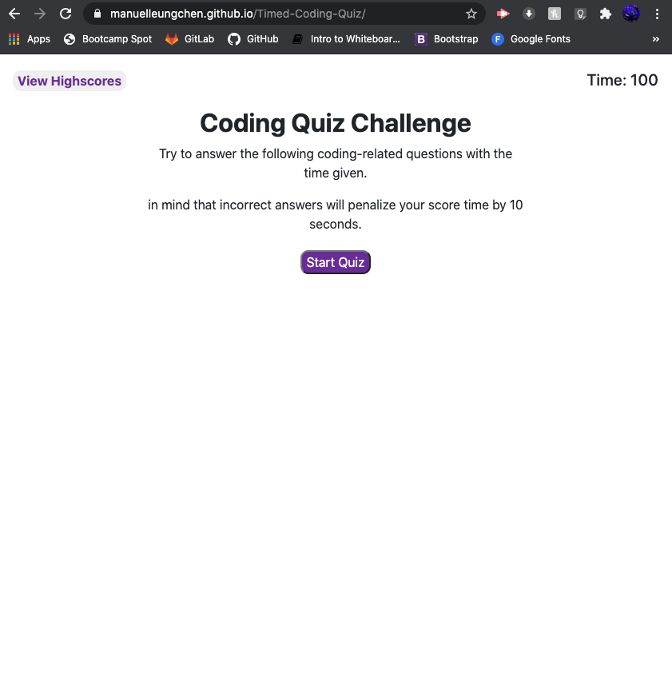

# Timed Coding Quiz
Timed Coding Quiz to practice JavaScript knowledge

   

# Password Generator

## Description
This repository **\([Timed Coding Quiz](https://github.com/manuelleungchen/Timed-Coding-Quiz)\)** contains a Web Application that generates a time base quiz with Java Script questions. The languages use on this website are **HTML 5**, **CSS**, **Bootstrap** and **JavaScript**. This source code is available to everyone under the standard [MIT license](https://github.com/manuelleungchen/Timed-Coding-Quiz/blob/main/LICENSE).

## Features
* Each student have 100 seconds to finish the quiz
* The time left represents the score
* Incorrect answer reduce the time by 10 seconds
* Student can save score with his initials
* Highscores are storage on local storage 



## Acceptance Criteria
```
GIVEN I am taking a code quiz
WHEN I click the start button
THEN a timer starts and I am presented with a question
WHEN I answer a question
THEN I am presented with another question
WHEN I answer a question incorrectly
THEN time is subtracted from the clock
WHEN all questions are answered or the timer reaches 0
THEN the game is over
WHEN the game is over
THEN I can save my initials and score
```

## Instructions
1. Go to [Coding Quiz Website](https://manuelleungchen.github.io/Timed-Coding-Quiz/)
2. Click on Start Quiz button
3. Answer as fast and accurally as you can
4. Enter initials 
5. Submit score
6. Check Highscores

## Credits
All changes and improvements were implemented by:

Manuel Leung Chen [GitHub](https://github.com/manuelleungchen)

## License
Copyright \(c\) Microsoft Corporation. All rights reserved.

Licensed under the [MIT license](https://github.com/manuelleungchen/Timed-Coding-Quiz/blob/main/LICENSE).

